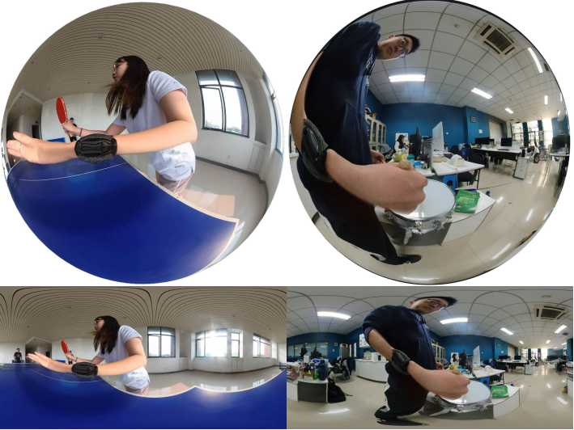

---
# Leave the homepage title empty to use the site title
title:
date: 2022-10-24
type: landing

sections:
  - block: hero
    content:
      title: |
        Video Understanding
  
  #- block: collection
  #  content:
  #    title: Latest News
  #    subtitle:
  #    text:
  #    count: 5
  #    filters:
  #      author: ''
  #      category: ''
  #      exclude_featured: false
  #      publication_type: ''
  #      tag: ''
  #    offset: 0
  #    order: desc
  #    page_type: post
  #  design:
  #    view: card
  #    columns: '1'
  
  #- block: markdown
  #  content:
  #    title: Abstract
  #    subtitle: ''
  #    text: Accurate 3D perception is essential for autonomous driving. Traditional methods often struggle with geometric ambiguity and slow convergence due to a lack of geometric prior. To address this challenge, we use omnidirectional depth estimation, which is generated by our lab's XXXNET, to introduce geometric prior. Based on the depth information, We propose a cylindrical voxel-based Sketch-Coloring framework. Additionally, our approach introduces a cylindrical voxel representation based on polar coordinate, better aligning with the radial nature of panoramic camera views. This representation adjusts voxel density according to distance, boosting the performance of close proximity. We also build a virtual scene dataset with six fisheye cameras, addressing the lack of fisheye camera dataset in autonomous driving tasks. Experimental results demonstrate that our Sketch-Coloring network significantly enhances 3D perception performance, especially in nearby regions, which makes our method a promising solution for autonomous driving perception.
  
  - block: markdown
    content:
      title: WristDaily360 Dataset
      subtitle: ''
      text:  

 

 
 We build the panoramic human activity dataset WristDaily360 from the perspective of wrist wearing. This dataset collects panoramic human behavior video data recorded from the wrist perspective. Its content mainly records people's daily activities, including sports, entertainment, household chores, learning, and other activities. 
  <video src="dataset.mp4" autoplay="autoplay" loop="loop" controls="controls"></video>
  
  #add some unique images
    #design:
    #  columns: '1'
    #  background:
    #    image: 
    #      filename: coders.jpg
    #      filters:
    #        brightness: 1
    #      parallax: false
    #      position: center
    #      size: cover
    #      text_color_light: true
      spacing:
        padding: ['20px', '0', '20px', '0']
      css_class: fullscreen

  #- block: collection
  #  content:
  #    title: Latest Preprints
  #    text: ""
  #    count: 5
  #    filters:
  #      folders:
  #        - publication
  #      publication_type: 'article'
  #  design:
  #    view: citation
  #    columns: '1'

  - block: markdown
    content:
      title:
      subtitle:
      text: |
        {}
    design:
      columns: '1'
---
